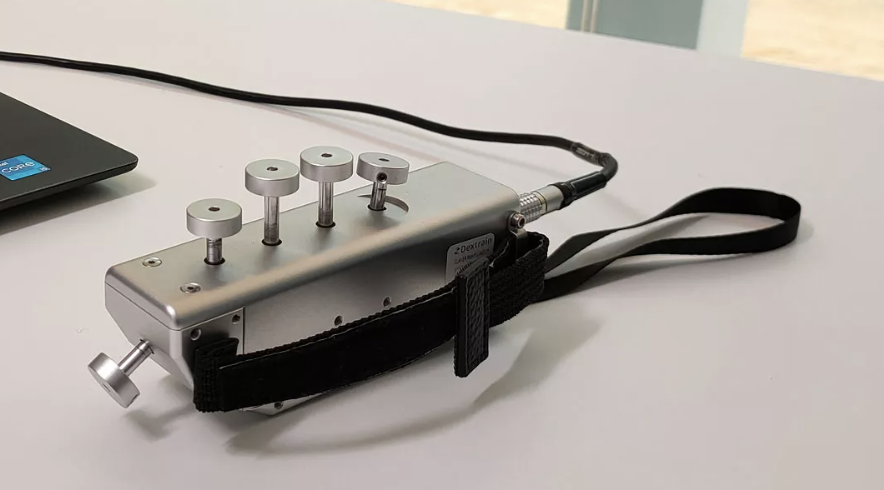
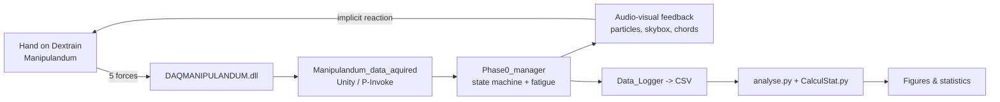
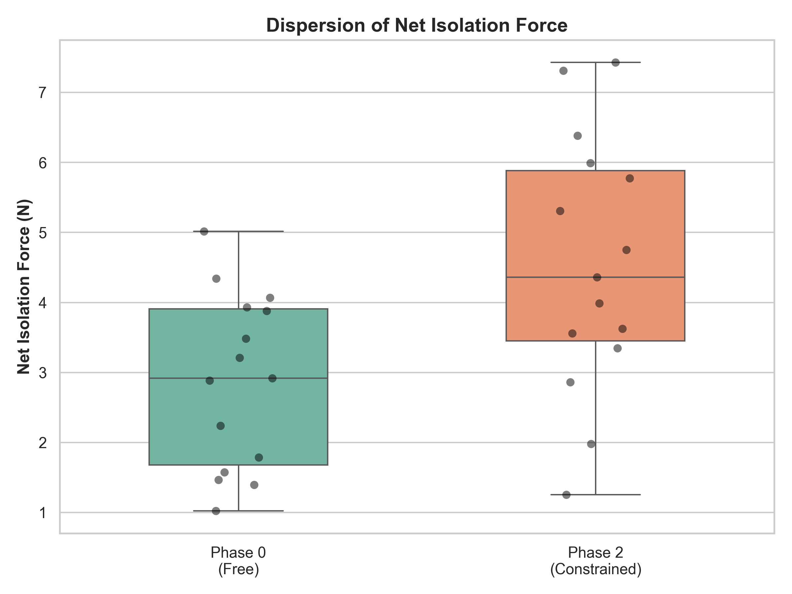
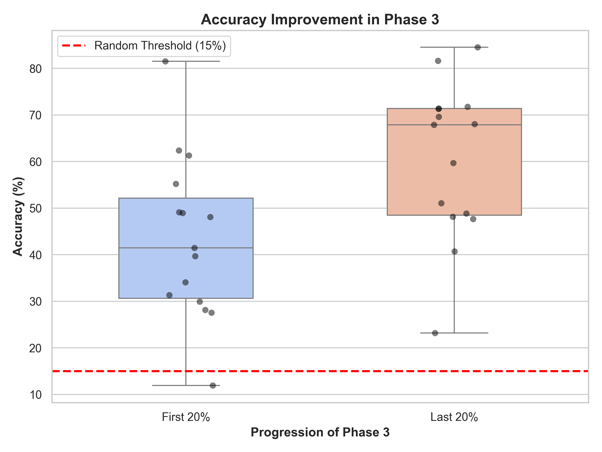

# Forest of Senses

> An interactive audio-visual environment that induces measurable motor
> adaptation without a single instruction, controlled by a five-finger
> isometric force sensor. Research prototype for post-stroke
> neurorehabilitation.

📄 A full research manuscript (*Study on Silent Guidance: Free Exploration
as a Vector for Implicit Motor Adaptation*) describing the protocol, cohort
and statistical results is available: [`paper_EN.pdf`](docs/paper_EN.pdf).

**Status** — Research prototype. Pilot study completed on 15 healthy
subjects.

### Headline numbers

| Metric                                           | Result                          |
|--------------------------------------------------|---------------------------------|
| Cohort                                           | 15 healthy subjects (21–63 y)   |
| Net Isolation Force, Phase 0 → Phase 2           | **2.88 N → 4.53 N** (+57 %)     |
| Sub-maximal accuracy, Early P3 → Late P3         | **43.4 % → 60.4 %** (+39 %)     |
| Statistical test                                 | Wilcoxon signed-rank, N = 15    |
| Significance                                     | p = 0.0020 / p = 0.0054         |
| Effect size (Cohen's d)                          | 0.99 / 0.86                     |
| Subjects who consciously identified the rule     | 13 / 15 (86.7 %)                |

### Reading this repo in 60 seconds

1. Watch the MP4 clips in [the Demo section](#demo) to see what the user
   experiences (audio matters — unmute).
2. Skim [`docs/architecture.md`](docs/architecture.md) for the system
   diagram and phase state machine.
3. Open [`unity/Scripts/Phase0_manager.cs`](unity/Scripts/Phase0_manager.cs)
   and [`unity/Scripts/Data_Logger.cs`](unity/Scripts/Data_Logger.cs) for
   the gameplay state machine and per-frame CSV logger.
4. Open [`analysis/analyse.py`](analysis/analyse.py) for the offline
   pipeline (Wilcoxon + Cohen's d + figures).
5. Read [`docs/paper_EN.pdf`](docs/paper_EN.pdf) for the full method,
   discussion and references.

> Inline code comments are in French (project carried out in a French
> research lab); identifiers and public APIs are in English.

---

## Demo

*Dextrain Manipulandum — the plug-and-play USB sensor (single cable to the
host PC, no calibration rig required) measuring per-finger isometric
compression that drives the entire interaction.*

> The environment runs on a specific research device (see [Why this repo
> exists](#why-this-repo-exists)) and cannot be launched from this
> repository. Captures of the real-time behaviour are provided as MP4
> because audio is part of the feedback loop, on equal footing with
> visuals. The low-pass filter cutoff, the harmony of triggered chords,
> and the tempo of familiar music drive the motor adaptation. Use the
> in-player controls to unmute.
>
> **Time-lapse disclaimer.** An original session lasts approximately
> **10 minutes** per subject. The clips below are time-compressed to
> ~15 s each so that the ambient evolution of the scene (campfire
> lighting, starry night, daybreak, snow melting) is visible at a glance.
> Absolute force levels, fatigue dynamics and accuracy statistics in the
> paper are of course measured on the real, uncompressed session.

#### Phase 0 — free exploration

<!-- VIDEO_PLACEHOLDER: Phase 0 — free exploration — drag-drop du MP4 dans l'éditeur web GitHub -->

#### Phase 1 — rotation & volume

<!-- VIDEO_PLACEHOLDER: Phase 1 — rotation & volume — drag-drop du MP4 dans l'éditeur web GitHub -->

#### Phase 2 — isolation & chords

<!-- VIDEO_PLACEHOLDER: Phase 2 — isolation & chords — drag-drop du MP4 dans l'éditeur web GitHub -->

#### Phase 3 — sub-maximal target

*The audio track contains gameplay-critical tempo-modulated piano
pieces; see [Music used in Phase 3](#music-used-in-phase-3--attribution-and-research-use)
for the composer attribution and the rights-use framing.*

<!-- VIDEO_PLACEHOLDER: Phase 3 — sub-maximal target — drag-drop du MP4 dans l'éditeur web GitHub -->

---

## Context

Conventional interactive neurorehabilitation relies on directive
instructions: *press this finger, reach this target, hold for N seconds*.
This approach guarantees cognitive understanding of the task but tends to
suppress spontaneous exploration and, with it, the intrinsic motivation
that sustains long therapy sessions. Literature on engagement
psychology [Peters et al., 2018] and on player onboarding in low-complexity
environments [Hatzl et al., 2024] converges on the same observation:
**implicit** cues preserve agency where explicit ones break it.

Forest of Senses transfers that observation from game design to clinical
biomechanics. The environment is designed so that the user never receives
an instruction, yet the interaction mechanics *force* their central nervous
system to adapt along two axes known to matter for post-stroke recovery:
finger individuation (inhibition of synkinesis) and sub-maximal force
regulation. The clinical justification for both targets is well established
in the literature [Xu et al., 2017; Térémetz et al., 2023].

---

## How it works

Five-finger isometric forces are captured by the **Dextrain Manipulandum**
(~14 Hz) and streamed into a Unity-based audio-visual environment. A phase
state machine progressively changes the contingencies between force output
and environmental feedback, introducing implicit biomechanical constraints
— a *winner-takes-all* rule, a virtual-fatigue gauge, an invisible
sub-maximal target — without ever showing them to the user. All samples
are logged per frame to CSV for offline analysis.

Detailed diagram and state machine: [`docs/architecture.md`](docs/architecture.md).

### Narrative progression — scenery as the only progression signal

The environment carries a deliberate artistic parallel with the
rehabilitation journey. There is no UI, no score, no timer, no text: the
**scenery itself** signals progression, mirroring the slow, non-linear
return of function that characterises post-stroke recovery.

- **Phase 0 — embers.** Winter night, dim light; a dormant campfire
  awaits a first spark of voluntary activity.
- **Phase 1 — fire relights, stars emerge.** The campfire grows with
  sustained effort, and a starry sky appears as the user starts rotating
  between fingers to circumvent virtual fatigue.
- **Phase 2 — day breaks.** Dawn unfolds as the user begins isolating
  individual fingers and modulating amplitude; harmonic chords replace
  single notes.
- **Phase 3 — snow melts.** When the user maintains the invisible
  sub-maximal target, the snowfield around the scene gradually thaws —
  the strongest and slowest reward of the session.

The user is never told this evolution is tied to their performance. It is
read, not explained.

---

## Scientific approach

### Protocol

- **Cohort** — 15 healthy subjects, 21–63 y (mean 27.6), 14 right-handed,
  1 left-handed, convenience sampling. Oral informed consent, minimal-risk
  observational study; no formal ethics committee approval was deemed
  necessary for this non-clinical proof-of-concept, in accordance with
  institutional practice (IFT / ESILV).
- **"Zero-Instruction" rule** — each session opens with a single sentence:
  *"With this sensor, you will control what happens in the world. Explore
  freely. There are 4 phases, the first is just a one-minute calibration
  phase."* No further guidance is given.
- **Four phases** — Baseline → Rotation & Volume → Isolation & Amplitude →
  Spatial Convergence. Phases chain automatically when the algorithm
  detects enough frames satisfying the current implicit constraint.
- **Session duration** — ~10 minutes per subject.
- **Post-session questionnaire** — perceived goal, identification of the
  rotation trigger, awareness of the isolation rule, Likert (1–5) on
  visual vs. auditory modality.

### Kinematic metrics

- **Net Isolation Force** — `F_max − F_second_max`. High value ⇒ good
  inhibition of synkinetic co-contractions. Computed only on frames where
  the maximum finger force exceeds 0.5 N, to exclude rest and sensor
  noise.
- **Sub-maximal accuracy** — normalized absolute error
  `E = |F_applied − F_target| / 5`, passed through a non-linear transfer
  function (initial tolerance plateau, sigmoidal degradation, critical
  failure around `E ≈ 0.8`). The resulting score `P ∈ [0, 100]%` is the
  reward signal modulating visual-ring clarity, low-pass cutoff and
  musical tempo.

### Statistical analysis

Intra-subject comparisons (Phase 0 vs. Phase 2; Early Phase 3 vs. Late
Phase 3) were performed with the non-parametric **Wilcoxon signed-rank
test** (N = 15, α = 0.05). Effect magnitude was reported as **Cohen's d**.
See [`analysis/analyse.py`](analysis/analyse.py) and
[`analysis/CalculStat.py`](analysis/CalculStat.py).

### Main results

| Axis                          | Phase 0 / Early | Phase 2 / Late | p-value  | Cohen's d |
|-------------------------------|-----------------|----------------|----------|-----------|
| Net Isolation Force (N)       | 2.88            | 4.53           | 0.0020   | 0.99      |
| Sub-maximal accuracy (%)      | 43.4            | 60.4           | 0.0054   | 0.86      |

*Figure 1 — Net Isolation Force shifts from 2.88 N (free exploration) to
4.53 N (implicit constraint) across the cohort.*

*Figure 2 — Sub-maximal accuracy tightens from 43.4 % to 60.4 % between the
first and last quintile of Phase 3, well above the ~15 % accuracy that a
random pressing strategy would mathematically yield.*

86.7 % of subjects (13/15) consciously identified the isolation rule; the
auditory modality scored significantly higher than the visual modality as
the leading vector of adaptation.

All six figures: [`analysis/figures/`](analysis/figures/).

---

## Current status and roadmap

### Scope: this is a research prototype

The deliverable of this development effort is the scientific manuscript,
not a polished game. V1 was built to make a well-controlled experimental
protocol run reliably and to produce analyzable behavioural data on 15
subjects. Every technical choice (hard-coded scenery, minimal shaders,
fixed 4-phase sequence, no main menu, no save system) serves that
single goal.

Aesthetic refinement is intentionally kept minimal at this stage: what is
submitted for evaluation is the experimental design, the behavioural data
it produced, and the engineering underneath — not the production value of
the environment.

### Roadmap

- [x] V1 research prototype (Unity + Dextrain) functional.
- [x] Pilot study on 15 healthy subjects.
- [x] Offline pipeline (individuation + sub-maximal convergence).
- [x] Manuscript drafted (*Silent Guidance*, see `docs/paper_EN.pdf`).
- [ ] Publication pathway under discussion with supervisors.
- [ ] Long-horizon clinical trial on post-stroke patients (contingent on
      ethics committee review).
- [ ] R&D track: **Somatic Generative AI** — replace hard-coded feedback
      with real-time generative image / sound conditioned on detected
      synkinesis, to scale the number of available affordances beyond what
      a handcrafted environment can provide.

---

## Technical stack

- **Engine** — Unity 6000.2 (URP).
- **Language** — C# (gameplay, state machine, logging), Python 3
  (offline analysis: pandas, numpy, scipy, matplotlib, seaborn).
- **Hardware** — Dextrain Manipulandum, a plug-and-play USB isometric
  5-finger sensor (single cable, no external power, no calibration rig);
  proprietary driver exposed to Unity through `P/Invoke`.
- **Data pipeline** — per-frame CSV (~14 Hz) → pandas DataFrames →
  Wilcoxon signed-rank / Cohen's d → matplotlib figures.

---

## Why this repo exists

Forest of Senses V1 is not a runnable project, and by design.

1. The interaction depends on the **Dextrain Manipulandum**, a research
   device. The accompanying driver (`DAQMANIPULANDUM.dll`) and its Unity
   wrapper (`Manipulandum_data_aquired.cs`) are not authored by me and
   their redistribution status is unclear; both are therefore kept out of
   this repository. A README stub describes the interface contract at
   [`unity/Scripts/Manipulandum_data_aquired.README.md`](unity/Scripts/Manipulandum_data_aquired.README.md).
2. The original Unity project pulls in a number of third-party
   asset-store packages (environment, skybox, campfire, terrain kit)
   whose licenses forbid source redistribution. Scenes, prefabs,
   materials and audio have therefore been excluded.

What remains is what matters for a portfolio reading:

- **The gameplay and research code I wrote** — state machine,
  winner-takes-all rule, virtual-fatigue gauge, per-frame CSV logger,
  season / audio / particle controllers.
- **The offline analysis pipeline** — individuation and sub-maximal
  convergence, significance testing, figure generation.
- **The anonymised dataset** — 15 participants × ~10 min × ~14 Hz,
  column schema documented in
  [`analysis/data/README.md`](analysis/data/README.md).
- **The manuscript** — full method, figures, discussion.

The goal is to show the **engineering and scientific reasoning**, not to
ship a game.

---

## Author

Paul Des Brosses — R&D Engineer | Hardware / Software Integration | Creative Tech
GitHub: https://github.com/paul-des-brosses · LinkedIn: https://www.linkedin.com/in/paul-des-brosses/

Research conducted at **IFT — Institut For The Future**, the ESILV
research laboratory, under the supervision of:

- **Paul-Peter Arslan** (IFT / ESILV)
- **Xiao Xiao** (IFT / ESILV)

Contact: `pdesbrosses@outlook.fr`

This repository is part of a public portfolio at the intersection of hardware, software and applied AI. Other projects:

- [Bocage Digital Twin](https://github.com/paul-des-brosses/bocage-digital-twin) — instrumented digital twin of a Norman bocage countryside (Unity 6 WebGL)
- [Applied Fox](https://github.com/paul-des-brosses/applied-fox) — local multi-agent AI system for R&D technology watch
- [Lightning TDOA Simulator](https://github.com/paul-des-brosses/lightning-tdoa-simulator) — simulation of a 3-station VLF lightning detection network

---

## Citing this work

A formal citation entry will be added to this repository once the
publication pathway for the manuscript is confirmed. In the meantime,
references to this project should point to the manuscript in
[`docs/paper_EN.pdf`](docs/paper_EN.pdf).

## Music used in Phase 3 — attribution and research use

Phase 3 of Forest of Senses uses **familiar piano music** as a real-time
biofeedback signal. The playback tempo is coupled to sub-maximal accuracy
(the rhythm converges back to the original tempo when the target force is
held) and a low-pass filter progressively opens as accuracy increases.
The mechanic *requires* the user to recognise the piece: without prior
familiarity, tempo distortion and spectral attenuation cannot be
perceived as a motor-reward signal. This is the neurophysiological
reason the study relies on well-known scores rather than abstract audio.

To retain full control over the audio signal chain — per-note MIDI
events, no pre-rendered tempo, direct filter modulation — the five
pieces were re-performed and sequenced by the author in MIDI. The
recordings carried in this repository are therefore **original
performances by Paul des Brosses**. The underlying compositions remain
the intellectual property of their respective rights holders and are
reproduced here only in the interactive, tempo-modulated form that the
experimental protocol requires.

| Piece                          | Composer (year)                                         | Composition rights         |
|--------------------------------|---------------------------------------------------------|----------------------------|
| Für Elise, WoO 59              | Ludwig van Beethoven (1810)                             | Public domain              |
| River Flows in You             | Yiruma (2001)                                           | © Stomp Music              |
| Hedwig's Theme (Harry Potter)  | John Williams (1999)                                    | © Warner Chappell Music    |
| Transformers Main Theme        | Steve Jablonsky (2007) / Ford Kinder, Anne Bryant (1984)| © Paramount / Hasbro       |
| Time (Inception)               | Hans Zimmer (2010)                                      | © Warner Bros              |

### Basis for inclusion

This repository is published as a **non-commercial research artifact**
documenting the engineering and scientific work behind the *Silent
Guidance* study. No revenue is derived from the music, the videos, the
source code or the accompanying manuscript. The inclusion of the Phase 3
capture is made on the following basis:

- **Transformative use.** The compositions are not played back as
  recordings but operated on in real time as a closed-loop biofeedback
  signal whose tempo and spectral content are driven by the user's
  biomechanics. The artistic experience heard in the demo is
  categorically different from the original work.
- **Necessity.** The *familiarity* of the piece is an independent
  variable of the paradigm (auditory recognition is a prerequisite for
  tempo-mismatch detection and for the reward value of tempo recovery).
  Substituting unknown music would change that variable and break the
  reproducibility of the study.
- **Limited extent.** The demo clip shows approximately 15 s of
  tempo-modulated audio per piece, sufficient to illustrate the
  mechanic, insufficient to substitute for the original.

### Good-faith takedown policy

If you are a rights holder, or represent one, of any of the listed
compositions and object to the presence of the Phase 3 capture in this
repository, please contact the author at `pdesbrosses@outlook.fr`. The
affected clip will be taken down without dispute.

## License

Original source code (C# gameplay scripts and Python analysis) is
released under the [MIT License](LICENSE). The manuscripts and figures in
`docs/` and `analysis/figures/` are made available for reference only and
remain the intellectual property of their authors.
