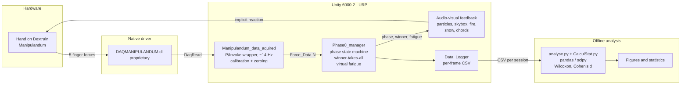
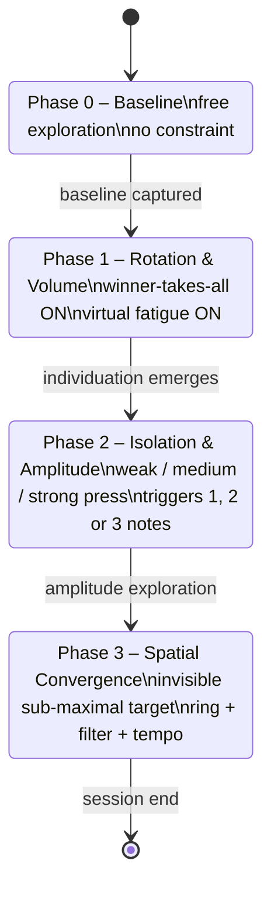

# Architecture

Forest of Senses V1 is a closed real-time loop between a five-finger isometric
force sensor and a Unity-based audio-visual environment. The loop is designed
so that every biomechanical input produces a contingent, **non-textual**
environmental reaction; no on-screen score, no tutorial, no instruction
beyond the opening sentence of the protocol.

## System diagram

## Key loop properties

- **Hardware coupling** — the Dextrain Manipulandum is plug-and-play
  (single USB cable, no external power, no calibration rig). The Unity
  side discovers the device through the native driver at session start.
- **Sampling rate** — native driver limits acquisition to approximately
  14 Hz. This frequency is sufficient to resolve isometric force dynamics
  but is not used for ballistic movement analysis.
- **Winner-takes-all rule** — from Phase 1 onward, only the single strongest
  finger is recognized as the effector; any parasitic co-contraction is
  penalized through feedback degradation.
- **Virtual fatigue** — prolonged effort on the dominant finger increments a
  per-finger gauge that progressively attenuates audio-visual feedback,
  implicitly forcing the user to rotate between fingers.
- **Affordance-only feedback** — the environment never communicates error
  in numerical form. Accuracy is exposed through the clarity of a visual
  ring, the cutoff of a low-pass filter, and the tempo of a familiar
  melody.

## Phase state machine

## Code map

| Area                 | Scripts                                                              |
|----------------------|----------------------------------------------------------------------|
| Hardware acquisition | `Manipulandum_data_aquired.cs` *(not redistributed — see README)*    |
| Session state        | `Phase0_manager.cs`                                                  |
| Logging              | `Data_Logger.cs`                                                     |
| Environment          | `SeasonManager.cs`, `SkyBoxController.cs`, `CampFireController.cs`, `GroundSnowController.cs`, `Particule_Controller.cs`, `WanderingMovement.cs`, `TerrainToMesh.cs` |
| Audio                | `WinterAudioManager.cs`, `WinterMelody.cs`                           |
| Offline analysis     | `analysis/analyse.py`, `analysis/CalculStat.py`                      |
